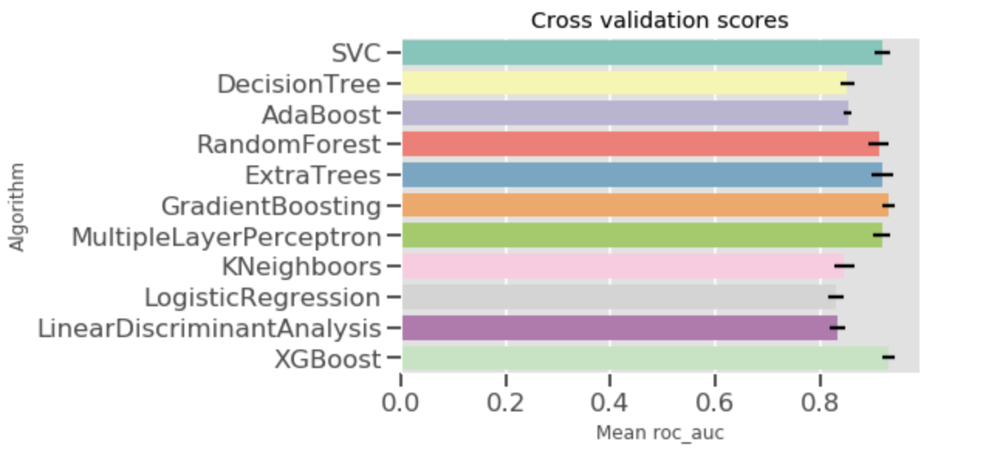
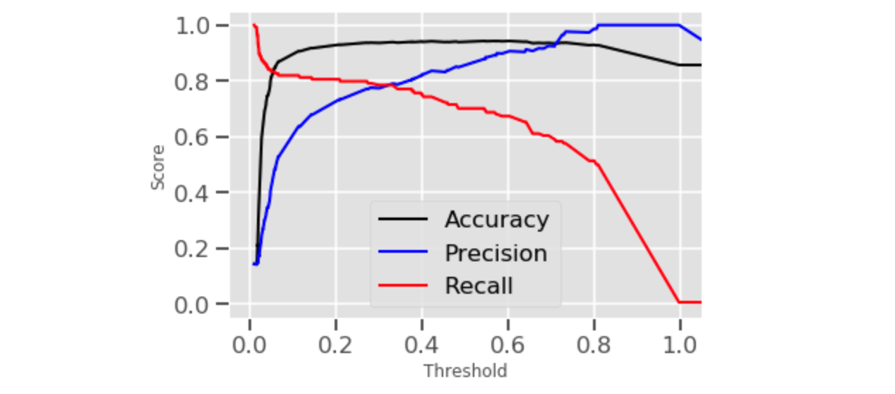

# Integrated Cell Phone User Churn Prediction

- 11 common Models, Ensemble Learning, Learning Curve, Confusion Matrix, Threshold determination, feature importance

Link -> https://github.com/bobbydyr/userchurn/blob/master/user_churn_prediction.ipynb

## Intro:
This is a course project, so data and analysis may not be so applicable to real life, but methodology and direction should be the ok. 

## Goal:

- With a background that it is really important for a telecommunication or cell phone service company to know how likely their customers will churn and more importantly who. So that company can offer discounts and other benefits for these portions of customers accurately. And minimize the loss.

1. Find out who they are.
2. Find out why they churn.
3. Suggestion on how to improve.

## Executive Summary:
1. Customers with more calls to the service center are mode likely to churn. And this is reasonable because the more calls with service center, the more problems they have.
2. Customers who were charged a lot and make a lot of call are less likely to churn. This is reasonable as well since the more calls they made, they become more rely and trust on our service.

## Steps:
1. Clean Data. 
    - Missing Value. There is no missing value in the raw dataset. But if there is,  I have millions of ways to solve.
    - Statistics analysis for each feature.
    - Strip String feature.
    - One hot encoding
2. Feature Engineering
    - One Hot Encoding
    - Change Yes/No to boolean values.
    - Standardization
3. Model Training and result evaluation
    - Stratified K-fold cross-validation for 11 models
    - Picked 6 models to do hyperparameter tuning with grid search and build learning curve.
    - Evaluated them with confusion matrix
    - Build ensemble model of all 6 model combined. 
4. Prediction And Precision Recall Trade Off
    - Threshold determination to minimize cost

